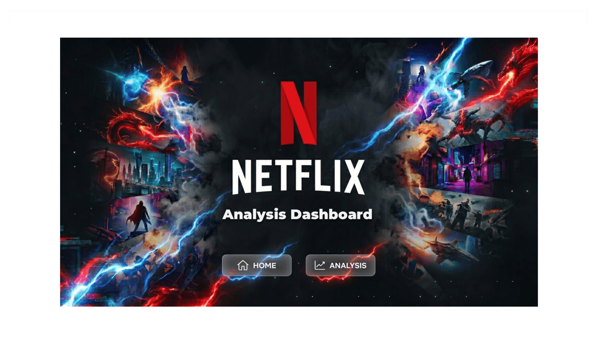

# Netflix Content Analytics

## Project Overview

This project analyzes Netflix content using Python and Pandas to uncover trends in genres, production countries, IMDb ratings, runtime, and content types.

## Objectives

* Perform data cleaning and preprocessing
* Handle missing values and duplicate records
* Analyze genre and country distributions
* Compare Movies vs TV Shows
* Explore IMDb ratings and runtime relationships
* Generate visual insights using Matplotlib

## Tools Used

* Python
* Pandas
* NumPy
* Matplotlib
* Jupyter Notebook

## Data Cleaning

* Removed duplicate records
* Handled missing values
* Converted stringified lists into Python lists
* Used explode() for genre and production country analysis
* Created separate datasets for genre and country analysis

## Key Insights

* Movies account for the majority of Netflix content.
* Drama and Comedy are among the most common genres.
* The United States contributes the highest number of titles.
* Content production has increased significantly in recent years.
* Runtime shows a weak correlation with IMDb ratings.

## Project Files

* netflix.csv – Original dataset
* genre_explode.csv – Genre-level analysis dataset
* country_explode.csv – Country-level analysis dataset
* Netflix_Analysis.ipynb – Complete analysis notebook

## Author

Vishal Singh
